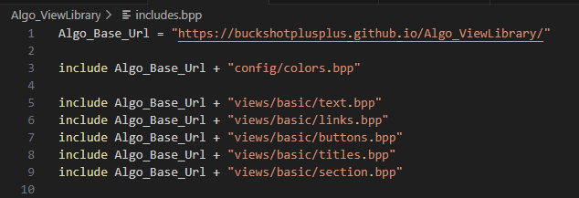

# String concatenation

String concatenation is useful when you want to concatenate multiple strings or variables together, simply using the + symbol, here is an example:

<figure><figcaption>
Example of string concatenation for includes
</figcaption></figure>
